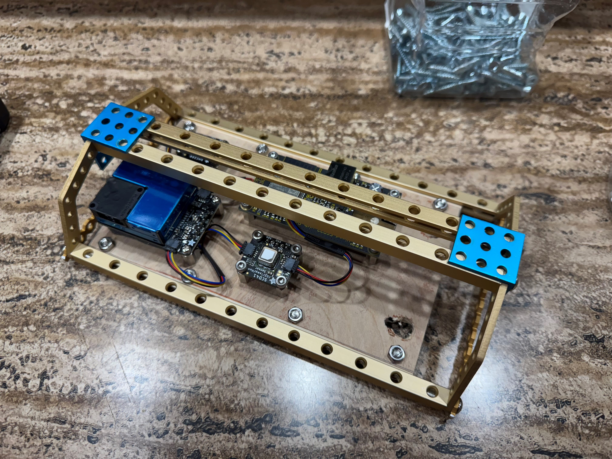
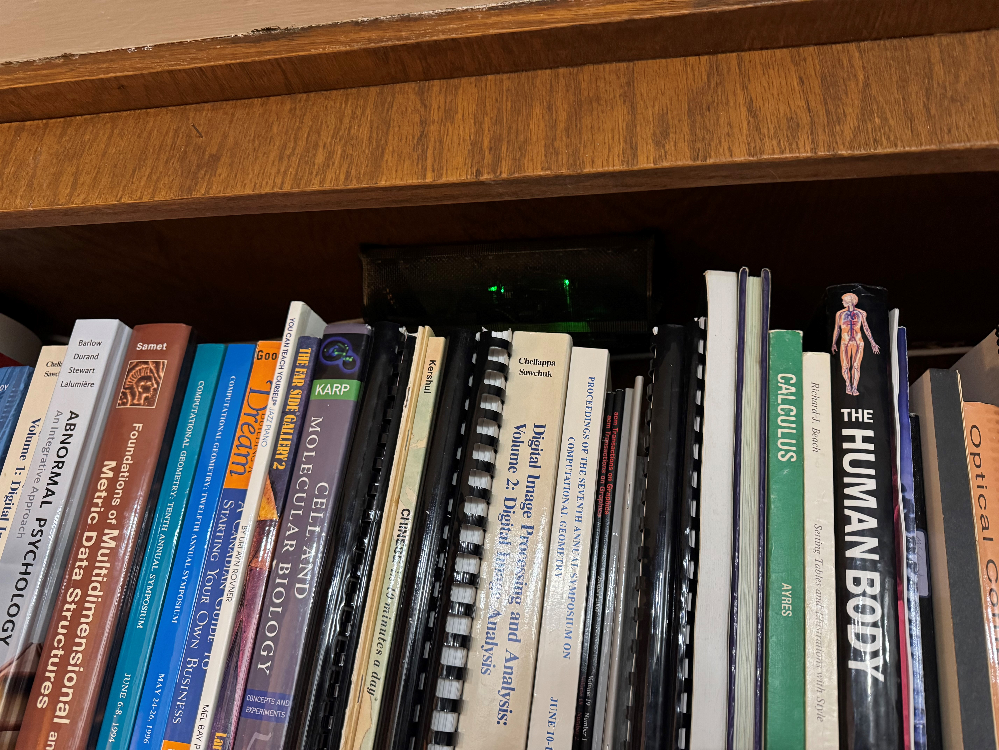

# ESPHome Air Quality Sensor
POE Air Quality Sensor based on ESPHome, works with Home Assistant.
Built around WESP32, powered by POE.  Does not support WiFi when wired connection is enabled (but it would be a pretty easy change, even with the same hardware, but in that case there are cheaper non-POE ESP32 boards that could be used).
Computes AQI using PM data.
Radio is used as a bluetooth Proxy (allowing, for example, access to data from nearby Inkbird temperature sensors).   Since WiFi is turned off this can work without interference or sharing of the radio!

Case design is up to you.  I smacked something together with Makeblock, a scrap of wood, and some window screen (to camoflauge it a bit while still allowing free airflow).

NOTE: There is currently an annoying bug in the PM device support so that when it first comes up after a power-on it is listed as "failed" and returns nonsense
huge values.  This seems to be a start-up timing issue, as reinstalling the code (which reboots the ESP32 without powering off the PM sensor) works just fine.
I think the PM sensor just needs time to warm up before the ESP32 trys to use it, and the ESPHome code is not waiting long enough before giving up on it.

To do: 
- Document required hardware BOM
- Tweak sampling rates to increase life of PM sensor
- Add a gas sensor for CO, Ozone, VOC, etc.
- Design 3D printable case.

